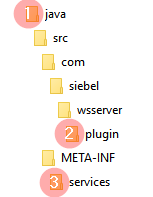
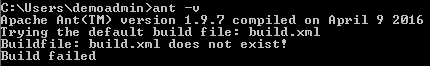
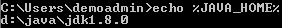
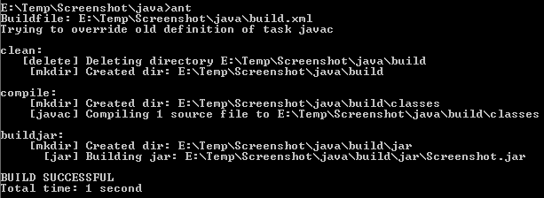
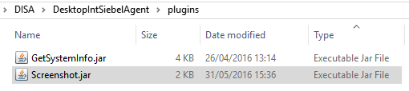
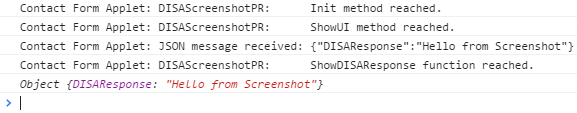

# Siebel Open UI DISA Integration Code Generator

## Overview
The purpose of this [code generator](http://duncanford.github.io/disa-code-generator) is to kickstart your next DISA integration. To aid this, the generator quickly stubs your extension by generating the content you need for the 5 files required at the bare minimum.

## Usage
To get started, unzip the [java.7z](support/java.7z) file to a working location. This helps you quickly create the file structure in which to place 3 of the files which are generated.



The numbers in the diagram are to help us place the code from the generator. Place the build.xml file you generated into the java top level directory (1), the manifest file into the java/META-INF/services directory (2), and the java code itself in the plugin directory at the bottom of the tree (3).

You're now ready to compile, but before you can do so, you'll need to set up [Ant](http://ant.apache.org/). Once installed properly you should be able to run ant straight from the command line. You can use the following to get the current version:

```
ant -v
```



Before finally compiling, just check that your JAVA_HOME is set correctly:

```
echo %JAVA_HOME%
```



Finally we can compile. Note that a successful compilation depends upon the ability of Java to locate the DISA libraries, so make sure you set your DISA location correctly in the generator if something goes wrong. To compile, you only need to type:

```
ant
```

If all goes well, you should see something similar to this:



Copy the jar file in the new build/jar folder and place it in your DISA/DesktopIntSiebelAgent/plugins folder:



Finally, restart DISA.

To test your plugin, you'll need to place the PR/PM code, register, and administer Siebel's manifest as normal for PR/PM extensions. With that done, you can test your new plugin. You should see some logging on the browser console to indicate that your DISA plugin was called and responded:



Please [report issues or make suggestions](https://github.com/duncanford/disa-code-generator/issues) as you see fit.
